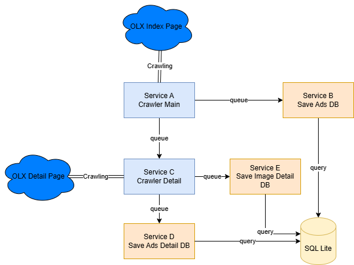

# Crawler OLX

Crawler OLX is a Python-based web scraper designed to extract data from OLX, a popular online marketplace. This project aims to gather information about listings, such as product details, prices, and seller information.

If I want to create a car advertisement crawler and integrate it with RabbitMQ, there are 4 services:

Service A: Main Crawler Service, acts as a crawler and publisher

Service B: Save Advertisement Service, acts as a database storage and consumer from Service A

Service C: Detail Crawler Service, acts as a crawler, publisher, and consumer from Service A

Service D: Save Advertisement Detail Service, acts as a database storage and consumer from Service C

Service E: Save Image Advertisement Detail Service, acts as a database storage and consumer from Service C

Details:

Service A (publisher) will crawl the OLX index, get brand, series, and price information. Then each successfully retrieved car will publish 2 messages. The first message sends car advertisement data to Service B. The second message sends the car advertisement detail page link to Service C.

Service B (consumer) will consume messages from Service A, then save the data to the database.

Service C (publisher & consumer) will consume messages from Service A, then crawl the car advertisement detail page, and send the crawling results to Service D.

Service D (consumer) will consume messages from Service C, then save the data to the database.

Service E (consumer) will consume message from Service C, then save the image url to the database



## Getting started

To get started, clone the repository:

```
git clone https://gitlab.com/hafiizhekom-belajar/crawler-olx.git
cd crawler-olx
docker compose up --build
```
